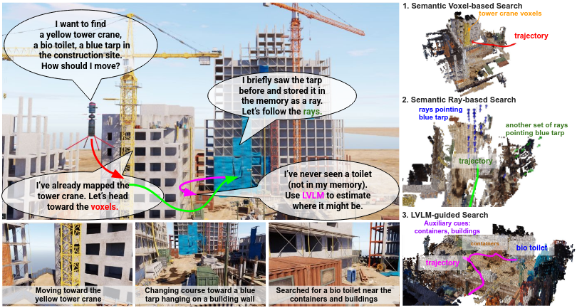

<p align="center">
<h1 align="center">RAVEN: Resilient Aerial Navigation via Open-Set Semantic Memory and Behavior Adaptation</h1>
<h3 class="is-size-5 has-text-weight-bold" style="color: orange;" align="center">
    IEEE International Conference on Robotics and Automation (ICRA) 2026
</h3>
<h3 class="is-size-5 has-text-weight-bold" style="color: orange;" align="center">
    (Oral Presentation)
</h3>
<p align="center">
    <a href="https://seungchan-kim.github.io" target="_blank"><strong>Seungchan Kim</strong></a><sup>1</sup>
    ·
    <a href="https://oasisartisan.github.io" target="_blank"><strong>Omar Alama</strong></a><sup>1</sup>
    ·
    <a href="https://scholar.google.com/citations?user=91gM0vQAAAAJ&hl=en&oi=ao"><strong>Dmytro Kurdydyk</strong></a><sup>2</sup>
    ·
    <a href="https://theairlab.org/team/johnk/"><strong>John Keller</strong></a><sup>1</sup>
    <br>
    <a href="https://nik-v9.github.io/" target="_blank"><strong>Nikhil Keetha</strong></a><sup>1</sup>
    ·
    <a href="https://theairlab.org/team/wenshan/" target="_blank"><strong>Wenshan Wang</strong></a><sup>1</sup>
    ·
    <a href="https://talkingtorobots.com/yonatanbisk.html" target="_blank"><strong>Yonatan Bisk</strong></a><sup>1</sup>
    ·
    <a href="https://theairlab.org/team/sebastian/" target="_blank"><strong>Sebastian Scherer</strong></a><sup>1</sup>
    <br>
    <sup>1</sup>Carnegie Mellon University &nbsp;&nbsp; <sup>2</sup>Davidson College
  </p>
</p>
  <h3 align="center"><a href="https://arxiv.org/pdf/2509.23563">Paper</a> | <a href="https://raven-semantic.github.io/">Project Page</a> | <a href="https://youtu.be/slLuZv3-zIs">Video</a></h3>
  <div align="center"></div>
<p align="center">
  
</p>

## Citation

If you find this code, dataset, or paper useful, please consider citing our work:

```bibtex
@article{kim2025raven,
  title={RAVEN: Resilient Aerial Navigation via Open-Set Semantic Memory and Behavior Adaptation},
  author={Kim, Seungchan and Alama, Omar and Kurdydyk, Dmytro and Keller, John and Keetha, Nikhil and Wang, Wenshan and Bisk, Yonatan and Scherer, Sebastian},
  journal={arXiv preprint arXiv:2509.23563},
  year={2025}
}
```

## Table of Contents

- [News/Release](#newsrelease)
- [Understanding Code Pipeline Structure](#understanding-code-pipeline-structure)
- [Setup](#setup)
- [Run RAVEN](#run-raven)
- [Environments](#environments)

## News/Release
- 01/31/2026: RAVEN was accepted to IEEE ICRA 2026!
- 10/25/2025: RAVEN was presented at IROS 2025 Active Perception Workshop, and received Outstanding Best Paper Award Finalist!
- 09/28/2025: arXiv paper is uploaded. Stay tuned for code release!

## Understanding Code Pipeline Structure

RayFronts serves as a perception and representation backbone of RAVEN. 

AirStack serves as an aerial robot autonomy stack, which supports interface for Isaac Sim, and handles sensors, global & local planning, collision avoidance. 


    +-------------+  Interface    +-------------------+    Sensor Topics    +-------------------+
    |  Isaac Sim  | ----------->  |     AirStack      | ------------------> |     RayFronts     |
    | Simulation  |               |  Autonomy Stack   |                     | Perception & Map  |
    +-------------+               |-------------------|                     |-------------------|
                                  | - Sim interface   |                     | - 3D Mapping      |
                                  | - Sensor drivers  |                     | - Representation  |
                                  | - Global planner  | <-------------------| - Semantic logic  |
                                  | - Local planner   |   Global Waypoints  | - Behavior Tree   |
                                  | - Collision avoid |                     |                   |
                                  +-------------------+                     +-------------------+ 

## Setup

First, clone this repository.

    git clone --recurse-submodules https://github.com/castacks/RAVEN.git
    cd RAVEN
    git checkout main
    git submodule update --init --recursive

Next, you should set up a docker image for RayFronts. Please follow the instructions in: [RayFronts Setup](https://github.com/seungchan-kim/RayFronts/blob/raven/README.md).

Now, for AirStack setup, please follow the instructions in: [AirStack Setup](https://github.com/castacks/AirStack/blob/raven/docs/README.md).

After setting up AirStack, download scenes: 

    cd ~/RAVEN/AirStack/scenes
    ./download_scenes.sh

**[Optional]** For LVLM-guided behavior and FPV+LVLM baselines, you need set up LVLM as well. Please follow the instructions in: [LVLM Setup](https://github.com/seungchan-kim/LVLM/blob/main/README.md).

## Run RAVEN

RAVEN can be started in two ways — choose whichever fits your workflow.

### Option A: Quick Start (Recommended)

A single script launches all components in a [tmux](https://github.com/tmux/tmux) session, with one window per component. Requires `tmux` (`sudo apt install tmux`).

    cd ~/RAVEN
    ./launch_raven.sh

To select a different environment, pass `--env`:

    ./launch_raven.sh --env FireAcademy

Supported values: `FireAcademy`, `RetroNeighborhood` (default), `AbandonedFactory`, `ConstructionSite`, `AbandonedCity`, `DowntownWest`, `Shipyard`.

To override the drone's initial position and orientation, use `--x`, `--y`, `--z`, `--qx`, `--qy`, `--qz`, `--qw`:

    ./launch_raven.sh --env FireAcademy --x 25.7 --y 11.5 --z 0.07
    ./launch_raven.sh --env AbandonedFactory --x 7.57 --y -5.5 --z 0.71 --qx 0.0 --qy 0.0 --qz 0.0 --qw 1.0

If not specified, each environment uses its own default pose (defined in `launch_raven.sh`).

For LVLM-guided behavior or FPV+LVLM baselines, add the `--lvlm` flag:

    ./launch_raven.sh --lvlm

This opens a tmux session with the following windows:

| Window | Component | Description |
|--------|-----------|-------------|
| `airstack` | AirStack + Isaac Sim | Simulation and autonomy stack |
| `rayfronts` | RayFronts mapper | Perception and semantic mapping |
| `input` | Input prompt | Text prompt interface (auto-starts once RayFronts is ready) |
| `annotation_viz` | Annotation visualizer | Publishes all ground-truth bounding boxes to `/annotation_bboxes_all` in RViz |
| `lvlm` | LVLM (optional) | Only with `--lvlm` flag |
| `stop` | Stop | Pre-loaded shutdown command |

The session opens on the `input` window by default. Switch between windows with `Ctrl+B` then the window number (e.g. `Ctrl+B 1` for `rayfronts`).  
Detach from the session with `Ctrl+B D` — all processes keep running.  
Re-attach anytime with `tmux attach -t raven`.

**GUI steps** (still required after launch):
1. Click **Play** in Isaac Sim
2. Click **Arm and Takeoff** in the RQT-GUI
3. Click **Global Plan** in the RQT-GUI

**To stop everything**, switch to the `stop` window and press `Enter`. This stops all containers and closes the tmux session.

> **First time only:** Pretrained models are downloaded automatically on first run. To avoid re-downloading on every fresh container startup, cache them into the Docker image after the first successful launch — see [Option B](#option-b-manual-multiple-terminals) below (expand → Caching pretrained models).

---

### Option B: Manual (Multiple Terminals)

<details>
<summary>Expand for full instructions</summary>

For users who prefer full visibility into each component in separate terminals.

#### Starting AirStack (Terminal 1)

In one terminal, start the AirStack with IsaacSim:

    cd ~/RAVEN/AirStack
    airstack up

An alternative command to `airstack up` is `docker compose up -d`. If using `docker compose up -d`, run `xhost +` first after a reboot — `airstack up` handles this automatically.

To select a different environment, edit `ISAAC_SIM_SCRIPT_NAME` in `~/RAVEN/AirStack/.env`:

    ISAAC_SIM_SCRIPT_NAME="FireAcademy_Launch.py"

Each scene script has its own default drone pose built in. To override the pose, export the variables before running `airstack up`:

    export DRONE_X=7.57 DRONE_Y=-5.5 DRONE_Z=0.71
    airstack up

This will start Isaac-Sim, RViz and RQT-GUI.

First, click the play button in Isaac Sim. 

Then hit the `Arm and Takeoff` button on the RQT-GUI. The robot will start taking off. 

(If you click `Fixed Trajectory` and `Publish` buttons, the robot will fly according to the predefined trajectory on the right configurations. We will not use this for RAVEN.)

Hit the `Global Plan` button. The robot will fly following a global waypoint plan. By default, AirStack generates random walk plans. For our purpose, RayFronts will continuously generate a semantic global plan and will overwrite it. 

#### Starting RayFronts (Terminal 2)

On another terminal, start the RayFronts docker container:

    cd ~/RAVEN/RayFronts
    ./run_docker.sh

Then, inside the RayFronts docker container, 

    ./run_mapping_server_rosnode.sh

##### Checking if RayFronts mapper is loading intrinsics:

You will see the following log messages (make sure to press the Play button in Isaac Sim):  

    [rayfronts.datasets.ros][INFO] - Waiting for intrinsics to be published..
    [rayfronts.datasets.ros][INFO] - Loaded intrinsics:
    ....
    [rayfronts.datasets.ros][INFO] - Ros2Subscriber initialized successfully.
If intrinsics is not loaded, check the [intrinsics topic in the configuration file](https://github.com/seungchan-kim/RayFronts/blob/cd5f9abfc773ed12e3be0697434cb1c25af7820c/rayfronts/configs/dataset/ros2isaacsim.yaml#L17), and verify that the expected ROS2 topics are being published:

    ros2 topic echo /robot_1/sensors/front_stereo/left/camera_info

##### Caching pretrained models inside the Docker image:

If this is your first time running the command, pretrained models will be automatically downloaded from external sources such as Torch Hub and Hugging Face. To avoid re-downloading on every fresh container startup, we recommend caching these files in the Docker image. For example, 

    docker commit <container_id> rayfronts:desktop

This will cache the pretrained models inside the existing rayfronts Docker image. 

##### Checking if RayFronts mapper is running correctly:
If you see log messages reporting mapping speed / efficiency similar to the example below, the RayFronts mapper is running correctly:


    [__main__][INFO] - [#   0#] Wall (#77462.1434# ms/batch - #  0.01# frame/s), Mapping (#369.3345# ms/batch - #  2.71# frame/s), Mapping/Wall (#0.4768%)
    [__main__][INFO] - [#   1#] Wall (#284.1268# ms/batch - #  3.52# frame/s), Mapping (#17.1590# ms/batch - # 58.28# frame/s), Mapping/Wall (#6.0392%)
    [__main__][INFO] - [#   2#] Wall (#797.8671# ms/batch - #  1.25# frame/s), Mapping (#13.3219# ms/batch - # 75.06# frame/s), Mapping/Wall (#1.6697%)
    .... 

#### Input Prompts (Terminal 3)

Once the RayFronts container is running, open another terminal and enter the container:

    docker exec -it rayfronts_container bash

Then run: 

    python3 input_prompt.py

You will see the following interface:

    === Input Publisher ===
    Current input: ''
    1. Set new input
    2. Clear input
    3. Exit

To set a new input prompt, type `1` and enter your text.  
To update the input, you can first clear it with `2`, then set a new one using `1`.  
To exit the program, type `3`.

#### Annotation Visualizer (Terminal 4)

Open another terminal and enter the RayFronts container:

    docker exec -it rayfronts_container bash

Then run:

    cd /workspace/RayFronts && python3 annotation_viz.py

This publishes all ground-truth bounding boxes to `/annotation_bboxes_all` in RViz.

#### Stopping

To shut down AirStack, run the following in any terminal inside `~/RAVEN/AirStack`:

    airstack down

`airstack down` is equivalent to `docker compose down`.

To stop RayFronts, run the following:

    docker stop rayfronts_container

</details>

## Environments

### Trying Different Environments

By default, the robot launches the `RetroNeighborhood` scene. To switch environments, pass `--env <name>` to `launch_raven.sh` (see [Quick Start](#option-a-quick-start-recommended)).

We are currently supporting:

    FireAcademy
    RetroNeighborhood
    AbandonedFactory
    ConstructionSite
    AbandonedCity
    Shipyard
    DowntownWest

Make sure these scenes were downloaded during the setup process. All scene files should be located in `~/RAVEN/AirStack/scenes`.

## Miscellaneous

### Debugging running containers

While running AirStack, you may want to inspect what is happening inside each Docker container. To enter the robot container:

    docker exec -it airstack-robot-1 bash
To enter the Isaac Sim container: 

    docker exec -it isaac-sim bash
Once inside the container, you can attach to the main session using tmux. 

    tmux a
To detach from tmux (without stopping processes): `Ctrl + B then D`. 

Container names may vary depending on your docker-compose setup.  
Use `docker ps` to list running containers.
